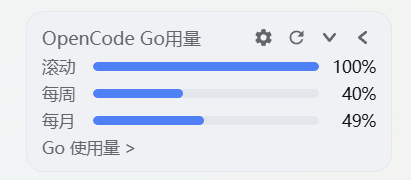
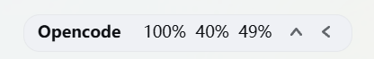

# @magiczerowxy/dsh-ocgo-usage

OpenCode Go 用量浮窗 for DeepSeek Harness web GUI：左下角悬浮窗，实时显示订阅配额用量进度条，支持三种窗口形态、一键折叠、自动刷新。

An OpenCode Go subscription quota widget for the DeepSeek Harness web GUI: a bottom-left overlay showing rolling/weekly/monthly usage progress bars in three window shapes, collapsible to a chip, auto-refreshing every 5 minutes.

## UI效果

| 大窗口 | 长条窗口 | 小窗口 |
| --- | --- | --- |
|  |  |  |

## 功能 Features

- **三种窗口形态**：大窗口（完整信息）、长条窗口（精简横条）、小窗口（紧凑胶囊），点击切换
- **一键折叠**：折叠成小胶囊，悬停展开，不遮挡对话区
- **用量进度条**：展示 OpenCode Go 订阅的滚动、周、月配额用量及进度
- **自动刷新**：每 5 分钟自动查询，也可手动刷新
- **API Key 管理**：浮窗内直接保存/清除 `OPENCODE_API_KEY`（经 DSH credentials 服务持久化，重启不丢失，绝不回传密钥值）
- **状态提示**：未配置 Key / 查询失败等状态清晰展示，引导配置

## 安装 Install

包已发布到 npm（`@magiczerowxy/dsh-ocgo-usage`），用官方 `dsh plugin` 命令安装：

```bash
dsh plugin --profile <profile> add @magiczerowxy/dsh-ocgo-usage
```

> `<profile>` 换成你自己的 profile 名：桌面版用 `desktop`，Web 版用 `web`，不带 `--profile` 操作默认 profile。
> 命令会自动把包写入 profile 依赖，并因声明了 `dsh.bundle` 自动加入 layer stack。

## 配置 API Key

两种方式任选其一：

1. **环境变量**：设置 `OPENCODE_API_KEY=xxx` 后重启 DSH
2. **浮窗内保存**：点击浮窗 → 填入 Key → 保存（写入 `~/.dsh/.credentials.yaml`）

## 卸载 Uninstall

```bash
dsh plugin --profile <profile> remove @magiczerowxy/dsh-ocgo-usage
```

## 结构 Structure

```
dsh-ocgo-usage/
├── lib/
│   ├── index.js    # Host 半区：/api/dsh-ocgo-usage/* 路由（查询、Key 保存/清除）
│   └── client.js   # Client 半区：浮窗 UI + 三形态切换 + 折叠 + 自动刷新
├── screenshots/    # 界面截图
├── cordis.patch.yml  # bundle patch（entry id: ocgo-usage）
└── package.json
```

## License

MIT
