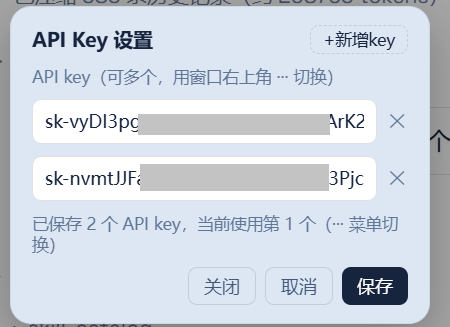
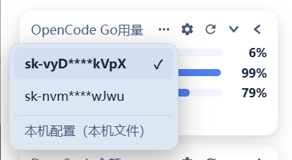

# @magiczerowxy/dsh-ocgo-usage

OpenCode Go 用量浮窗 for DeepSeek Harness web GUI：左下角悬浮窗，实时显示订阅配额用量进度条，支持三种窗口形态、一键折叠、自动刷新、**多 Key 快捷切换**，自动**堆叠**在余额窗上方。

An OpenCode Go subscription quota widget for the DeepSeek Harness web GUI: a floating window showing rolling/weekly/monthly usage progress bars in three window shapes, collapse chip, auto refresh, **multi-key quick switching**, and auto-**stacking** above the balance widget.

## UI效果

| 大窗口 | 长条窗口 | 小窗口 |
| --- | --- | --- |
|  |  |  |

## 多 Key 效果 Multi-key

| 填写多个 Key | 用量多 Key 显示与快捷切换 |
| --- | --- |
|  |  |

## 功能 Features

- **三种窗口形态**：大窗口（完整信息）、长条窗口（精简横条）、小窗口（紧凑胶囊），点击切换
- **一键折叠**：折叠成小胶囊，悬停展开，不遮挡对话区
- **用量进度条**：展示 OpenCode Go 订阅的滚动 / 周 / 月配额用量、百分比与重置时间，进度条为品牌蓝色
- **自动堆叠**：窗口自动检测余额窗高度并**堆叠在其上方**（间距 9px），两者互不遮挡
- **自动刷新**：每 5 分钟自动查询，也可手动刷新
- **多 Key 管理**：设置面板右上角「+ 新增Key」可同时保存多个 API Key；悬浮列表显示全部已填 Key，点击即可**快捷切换**当前查询所用 Key
- **分开设置**：OpenCode Go 用量与 DeepSeek 余额的 Key **各自独立保存**（`OPENCODE_KEYS` / `DSH_BALANCE_KEYS`），互不影响
- **Key 持久化**：输入即自动保存 + 关闭设置时强制落盘；多 Key 列表经 DSH 凭证服务持久化，**重启不丢失**
- **环境变量兼容**：本机已配 `OPENCODE_API_KEY` 环境变量时自动识别并使用（来源标识 env）
- **悬浮浮层**：独立浮窗（不嵌入侧边栏），实时跟随侧边栏宽度，侧边栏收起自动隐藏，过窄时标题自动省略号
- **毛玻璃外观**：16px 背景模糊 + 25% 半透明背景（浅色 25% 白 / 暗色 60% 深灰），明暗主题自适应
- **状态提示**：未配置 Key / 查询失败等状态清晰展示，引导配置

## 安装 Install

包已发布到 npm（`@magiczerowxy/dsh-ocgo-usage`），用官方 `dsh plugin` 命令安装：

```bash
dsh plugin --profile <profile> add @magiczerowxy/dsh-ocgo-usage
```

> `<profile>` 换成你自己的 profile 名：桌面版用 `desktop`，Web 版用 `web`，不带 `--profile` 操作默认 profile。
> 命令会自动把包写入 profile 依赖，并因声明了 `dsh.bundle` 自动加入 layer stack。

## 配置 API Key

### 单 Key

1. **环境变量**：设置 `OPENCODE_API_KEY=xxx` 后重启 DSH
2. **浮窗内保存**：点击浮窗 → 填入 Key → 保存（写入 `~/.dsh/.credentials.yaml`）

> 若 dsh 已接入 OpenCode（环境变量或凭据文件），设置对话框会自动探测并显示"已使用本机配置"，无需填写。

### 多 Key（本版新增，推荐）

1. 点击窗口右上角「···」→ 打开设置面板 → 右上角「**+ 新增Key**」逐条添加
2. 「···」旁悬浮层列出所有已填 Key，点击任意一条即可**快捷切换**当前查询所用 Key
3. 多个 Key 以列表持久化在凭证引用 `OPENCODE_KEYS`，重启后仍然保留

> **分开保存**：用量窗口的 Key 存在 `OPENCODE_KEYS`，余额窗口的 Key 存在 `DSH_BALANCE_KEYS`，两者互不覆盖、互不影响。

## 卸载 Uninstall

```bash
dsh plugin --profile <profile> remove @magiczerowxy/dsh-ocgo-usage
```

## 结构 Structure

```
dsh-ocgo-usage/
├── lib/
│   ├── index.js    # Host 半区：/api/dsh-ocgo-usage/* 路由（用量查询、Key 列表/保存/清除）
│   └── client.js   # Client 半区：浮窗 UI + 进度条 + 三形态 + 折叠 + 多Key + 堆叠 + 毛玻璃
├── screenshots/    # 界面截图
├── cordis.patch.yml  # bundle patch（entry id: ocgo-usage）
└── package.json
```

## 更新记录 Changelog（v0.1.3）

- **多 Key 支持**：可填写多个 API Key（右上角「+新增Key」），悬浮层快捷切换查看；与 DeepSeek 余额的 Key **分开设置**、分开持久化
- **持久化修复**：此前只在点"保存"时落盘、重启后 Key 丢失 → 改为**输入即自动保存 + 关闭设置强制落盘**，多 Key 列表写入凭证服务，重启不丢失
- **堆叠布局**：窗口自动检测余额窗高度并堆叠在其上方（间距 9px），两窗之间的间隔恢复且互不遮挡
- **排版优化**：进度条高度/间距细化，标签列宽固定、百分比加粗并使用等宽数字（tabular-nums），统计数字默认显示，行间留白调整
- **悬浮浮层**：窗口为独立浮层（非嵌入侧边栏），跟随侧边栏宽度，侧边栏收起自动隐藏；标题过窄时自动省略号
- **毛玻璃外观**：16px `backdrop-filter` 模糊 + 25% 半透明背景（浅色 `rgba(255, 255, 255, 0.25)` / 暗色 `rgba(16, 16, 22, 0.60)`），明暗主题各自配边框与阴影

## License

MIT
